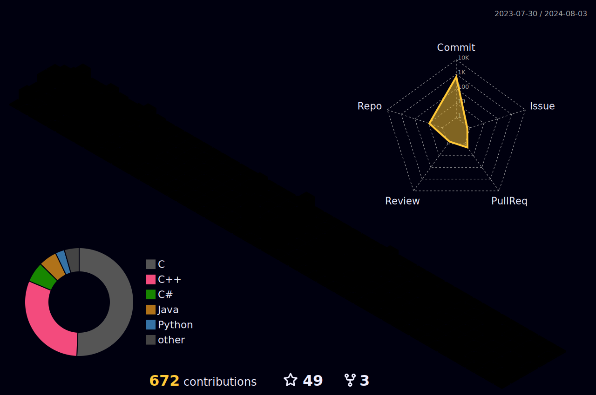

<h1 align="center">  👋 Hi, I'm Yusuf AYTAŞ </h1>
<h4 align="center" > I am a software engineer student and I share my projects here. 👨‍🎓 </h2>

## ⏲ What am i doing now:
- 🔭 I am currently developing myself towards becoming full stack. I am also interested in cyber security as a hobby. 👩‍💻
- 👋 Fact: I love to search and learn new informations 🚀</h3>

### 📩 Connect with me:
[][linkedin]
[][gmail]
[][w3schools]
[][stackoverflow]
[][googlefordevelopers]
[][huaweistudentdevelopers]
 
</a>

### 💻 Languages and Tools (Learning and Using): 

[][html5]
[][css3]
[][sass]
[][bootstrap]
[][javascript]
[][nodejs]
[][jquery]
[][typescript]
[][c#]
[][java]
[][mssql]
[][mysql]
[][git]
[][vscode]
[][webstrom]
[][codepen]
[][intellij]
[][vstudio]
 
</a>

 

[huaweistudentdevelopers]: https://www.linkedin.com/in/hsd-firat-university/
[googlefordevelopers]: https://developers.google.com/profile/u/yusufaytas
[linkedin]: https://www.linkedin.com/in/yusufaytasss/
[w3schools]: https://yusufaytas.w3spaces.com/
[stackoverflow]: https://stackoverflow.com/users/25539323/yusuf-aytas
[gmail]: mailto:yusufaytas642@gmail.com
[html5]: https://www.w3schools.com/html/
[css3]: https://www.w3schools.com/css/
[sass]: https://sass-lang.com/
[bootstrap]: https://getbootstrap.com/
[javascript]: https://www.javascript.com/
[typescript]: https://www.typescriptlang.org/
[nodejs]: https://nodejs.org/en
[jquery]: https://jquery.com/
[c#]: https://learn.microsoft.com/en-us/dotnet/csharp/
[vscode]: https://code.visualstudio.com/
[webstrom]: https://www.jetbrains.com/webstorm/
[codepen]: https://codepen.io/
[git]: https://git-scm.com/
[github]: https://github.com/yusufaytasss
[C]: https://en.cppreference.com/w/
[C++]: https://en.cppreference.com/w/
[java]: https://www.java.com/en/
[git]: https://git-scm.com/
[mssql]: https://www.microsoft.com/tr-tr/sql-server/sql-server-2019
[mysql]: https://www.mysql.com/
[intellij]: https://www.jetbrains.com/idea/
[linux]: https://www.linux.org/
[vstudio]: https://visualstudio.microsoft.com/
